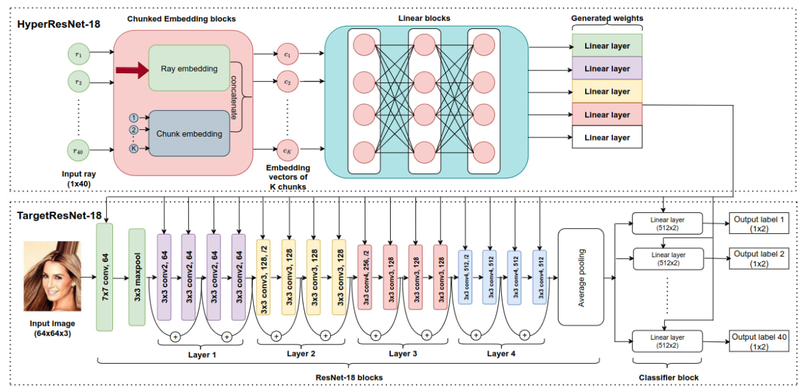

# CelebA
## Information
Refer to [Website](https://mmlab.ie.cuhk.edu.hk/projects/CelebA.html)

## Network architecture
We use Multi-ResNet-18 architecture



## Training
```
python3 phn_train.py --solver <solver for HPN> 
```
## Testing
```
python3 test.py
```

