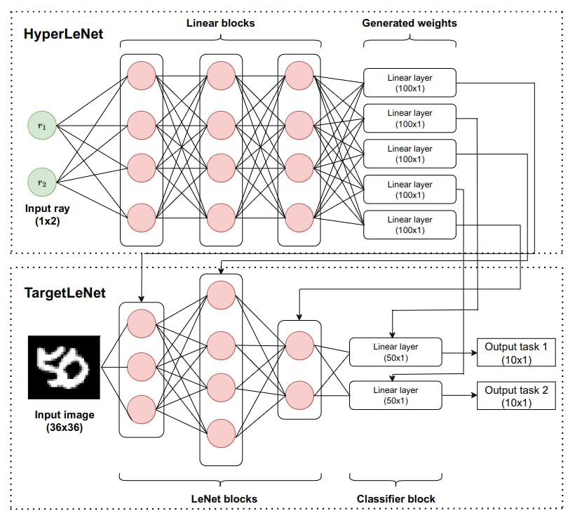

# A Framework for Pareto Multi Task Learning with Completed Scalarization Functions

Multi-LeNet architecture



## Training
```
python3 phn_train.py --data_path <path dataset> --solver <solver type>
```
## Testing
```
python3 test.py
```

