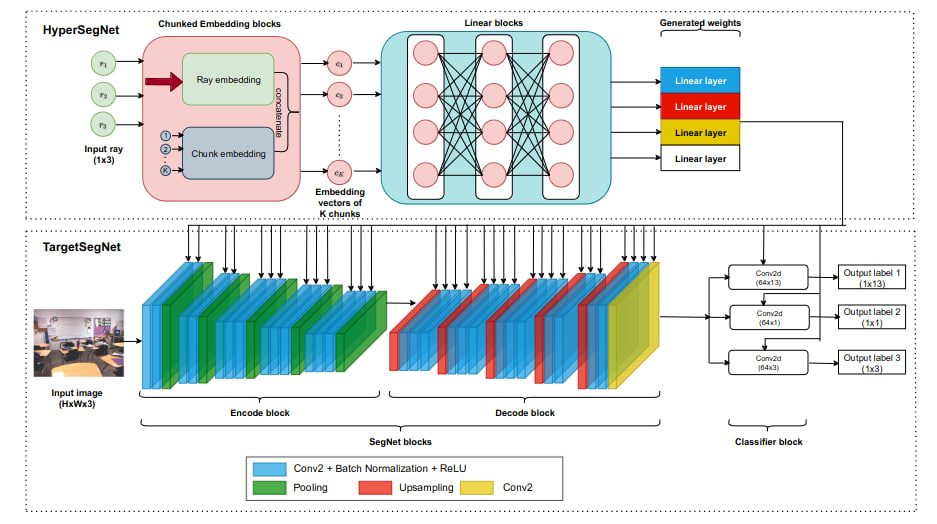

# NYUv2
## Information
Refer to [Website](https://cs.nyu.edu/~silberman/datasets/nyu_depth_v2.html)

## Network architecture
We useMulti-SegNet architecture



## Training
```
python3 phn_train.py --solver <solver type>
```
## Testing
```
python3 test.py
```

