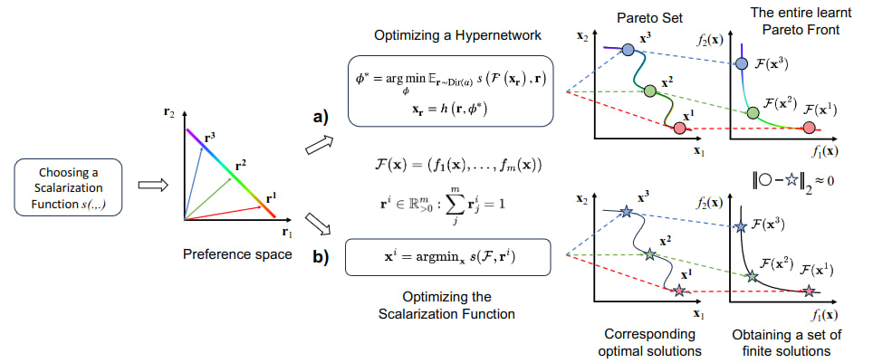
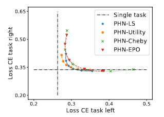
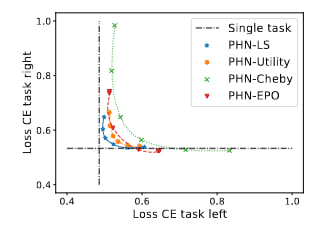
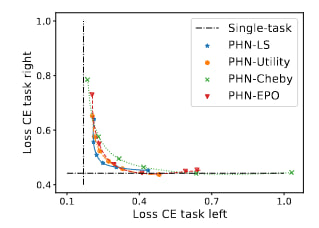

# A Framework for Controllable Pareto Front Learning with Completed Scalarization Functions and its Applications

<p align="center">
  <a href="https://pytorch.org/"></a>
  <a href="https://arxiv.org/abs/2302.12487" target="_blank"></a>
</p>

This is the official implementation for [Paper](https://arxiv.org/abs/2302.12487)  



Support MOO experiments in `MOP/` with problems:
| Problem  | Num of variables      | Num of objectives | Objective function | Pareto-optimal| 
|----------------------|------------------------------|------------------------------|------------------------------|------------------------------|
| ex1              | 1           |2|convex|convex|
| ex2               | 2       | 2 | convex | convex|
| ex3             | 3 | 3 | convex | convex|
| ex4            |    2         | 2 | convex | convex
| ZDT1        |       30      |  2  | non-convex | convex |
| ZDT2         |       30        |  2  | non-convex | non-convex |
| DTLZ2         |       10         |  3  |non-convex | non-convex |

ex3                   |  DTLZ2
:-------------------------:|:-------------------------:
  |  
  |  

Support MTL experiments in `MTL/experiments/Multi_task/` and `MTL/experiments/Multi_output/` with datasets:
| Dataset  | Num of tasks      | Website |
|----------------------|------------------------------|------------------------------|
| Multi-MNIST              | 2           ||
| Multi-Fashion               | 2       |  | 
| Multi-Fash+MNIST              | 2 |  |
| CelebA            |    40         | [link](https://mmlab.ie.cuhk.edu.hk/projects/CelebA.html) |
| NYUv2        |       3      |  [link](https://cs.nyu.edu/~silberman/datasets/nyu_depth_v2.html)  | 
| SARCOS         |       7        |  [link](http://gaussianprocess.org/gpml/data/)  | 

Multi-MNIST                   |  Multi-Fashion                 |  Multi-Fash+MNIST 
:-------------------------:|:-----------------------:|:-------------------------:
  |   | 

## Requirements
- Pytorch
- Python
- Latex

## Installation
```
pip3 install -r requirements.txt
```
## Contact

[]([trananhtuan23012000@gmail.com](https://github.com/tuantran23012000))  
*Please create an issue or contact me through trananhtuan23012000@gmail.com, thanks!*

## Author

Tran Anh Tuan

## Citation
If our framework is useful for your research, please consider to cite the paper:
```
@article{TUAN2024257,
title = {A framework for controllable Pareto front learning with completed scalarization functions and its applications},
journal = {Neural Networks},
volume = {169},
pages = {257-273},
year = {2024},
issn = {0893-6080},
doi = {https://doi.org/10.1016/j.neunet.2023.10.029},
url = {https://www.sciencedirect.com/science/article/pii/S089360802300583X},
author = {Tran Anh Tuan and Long P. Hoang and Dung D. Le and Tran Ngoc Thang},
keywords = {Multi-objective optimization, Multi-task learning, Pareto front learning, Scalarization problem, Hypernetwork},
abstract = {Pareto Front Learning (PFL) was recently introduced as an efficient method for approximating the entire Pareto front, the set of all optimal solutions to a Multi-Objective Optimization (MOO) problem. In the previous work, the mapping between a preference vector and a Pareto optimal solution is still ambiguous, rendering its results. This study demonstrates the convergence and completion aspects of solving MOO with pseudoconvex scalarization functions and combines them into Hypernetwork in order to offer a comprehensive framework for PFL, called Controllable Pareto Front Learning. Extensive experiments demonstrate that our approach is highly accurate and significantly less computationally expensive than prior methods in term of inference time.}
}
```
